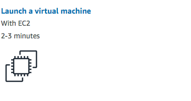
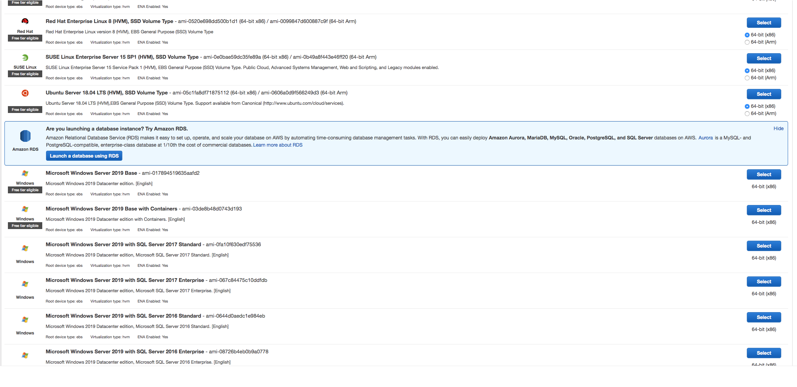
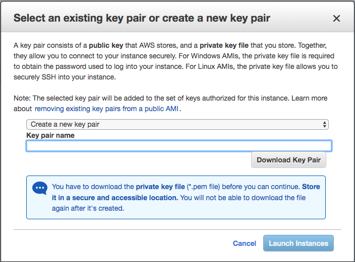
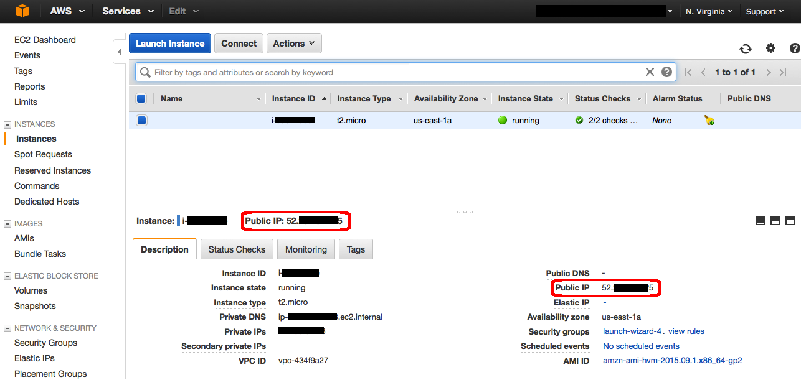
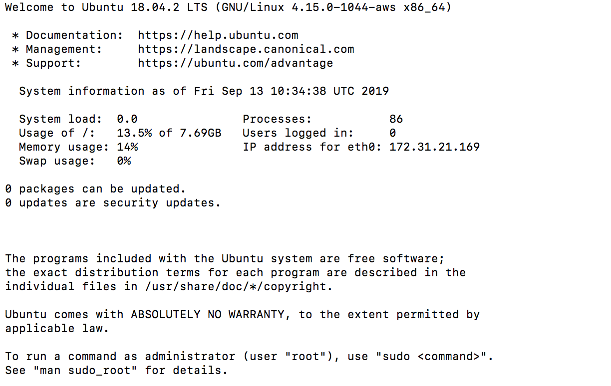

# AWS_manual_deployment
This readme covers the basics of manually deploying your application to AWS ECS instance and enable reverses proxy with Nginx as the load balancer

### Getting Started
To get started, create an account with [AWS](https://aws.amazon.com), After the successful creation of your account goto your AWS dashboard the following the instructions.

- Click on **Launch Virtual Machine with EC2**
  
- Next client select your **Amazon Machine Image (AMI)**. In my case, I'm using Ubuntu Server 18.04LTS on the next step, just select review and launch to create the instance
  
- Once you press the launch button, the service will ask you to select a key pair, this will be your ssh key. Kindly select `create a new key pair`, then you'll be prompt to enter the name of the key pair. Enete a name and download it. When that's done, launch the instance you'll be able to view the details of the instance.
  
  With that said, you should get a page that looks like this
  
- Copy the pem file from your download path to your `~/.ssh` directory `cp  ./YourPathToYour.pem file ~/.ssh` then run `chmod 400 ~/.ssh/your.pem file` to restrict public access to your ssh key.

- run the following `ssh -i ~/.ssh/your.pem ubuntu@{IP_Address}`, you should get something like this.
  
  Congrats, you've successfully logged into your EC2 instance

#### Up Next: Hosting Your App
Follow the proceeding steps to deploying your application

- Run `vagrant up`
- SSH into the `frontend_server` by runing `vagrant ssh frontend_server`
- `sudo apt-get update`
- Run `sudo apt-get install -y avahi-daemon libnss-mdns`
- `sudo apt-get install git -y` creates a network layer for your front-end and backend server to work together
- `curl -sL https://deb.nodesource.com/setup_10.x | sudo -E bash -` this will Install the standard Debian/Ubuntu packages for Node and npm
- `sudo apt-get install -y nodejs` 
- `sudo npm install -y node-gyp -g` node-gyp is a tool which compiles Node.js Addons. Node.js Addons are native Node.js Modules, written in C or C++, which therefore need to be compiled on your machine

- `git clone https://github.com/andela/metis-ah-frontend.git sims_project`

- `cd sims_project`
- `npm i `
- `npm run build`
- `npm start`

Goto http://YourPublicDNS:3000

#### Keeping the app awake
Your application will continue to run as long as you have the terminal open. What happens when you stop the process? You're right, the application stops running.
We're going to keep the application running by installing `pm2` - PM2 is a process manager for node that allows you to keep your application running forever.
- Start by killing all node process by running `killall -9 node`
- install PM2 `npm install pm2 -g`
- Run `pm2 start npm --name "<name_the_process_anything_you_want>" -- start` this will run the build and start the server
- Run `pm2 startup` which output a script on the browser which you need to run
- Run `pm2 save` this will keep the server running

